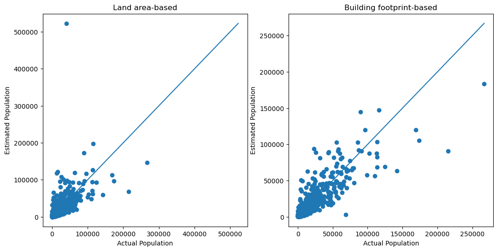
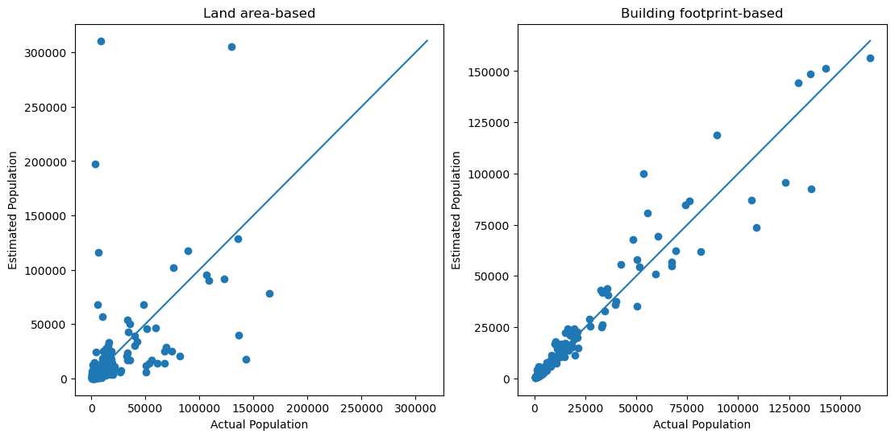

# Population disaggregation

In these Python notebooks, I explored the disaggregation of population using various datasets.

## What is population disaggregation?
Population disaggregation is the breaking down of population data with coarser geographic division (e.g. city) to finer spatial units (e.g. barangay, city blocks, buildings).

## Method overview
I used two methods to disaggregate population:

1. Population in a big geographic unit is allocated to a smaller subunit based on its portion of <u>**land area**</u>
2. Population in a big geographic unit is allocated to a smaller subunit based on its portion of <u>**building footprint area**</u>

To test the methodologies' performance, city-wide census data were disaggregated to barangay-level using both methods for NCR and Rizal.

## Data used
There were 2 building footprint datasets considered for this analysis

1. Google's Open Buildings
2. OpenStreetMap (OSM) Buildings layer

Unfortunately, OSM building data have gaps in some areas in NCR. Ultimately, Google's Open Buildings data was used for the population disaggregation.

OSM datasets (including its building data) were explored for the future refinement of the methodology.

## Caveats

The geospatial data used for the administrative boundaries was, unfortunately, outdated, as compared to the 2024 population census data. The changes that were not yet reflected on the administrative boundary data include:
- some barangays in Makati being transfered to Taguig's jurisdiction
- Barangay 176 (Bagong Silang), Caloocan being divided into six smaller barangays

For this analysis, the outdated administrative boundaries were used, and the census data were modified accordingly.

## Results

The following errors were calculated for the estimated barangay population for NCR, as well as a plot of the estimated vs actual population:
| Method | RMSE | MAE |
|---|---|---|
| Land area-based | 16232.5 | 4515.9 |
| Building footprint-based | 8883.5 | 3503.8 |

The following were for Rizal:
| Method | RMSE | MAE |
|---|---|---|
| Land area-based | 35837.0 | 13720.9 |
| Building footprint-based | 7760.9 | 3579.0 |

Bigger improvement was observed for Rizal than for NCR. This can be attributed to NCR being covered mostly by buildings/built-up areas (except for certain areas), while there are substantial forested/grassland/shrubland areas in Rizal.

## Refinement
A small percentage of the OSM buildings data has a "*type*" attribute, which can state if a building feature is a house, retail building, hospital etc.

Using this small portion of OSM buildings data, a *RandomForest* model was trained to classify a building footprint as a house or not. This model is then <u>**applied to the Google's Open Buildings data**</u>.

Using this, population disaggregation was applied, but only using the buildings that were classified as *houses*.

## Refinement results

The following errors were calculated for the estimated barangay population for NCR:
| Method | RMSE | MAE |
|---|---|---|
| Building footprint-based | 8883.5 | 3503.8 |
| "House" footprint-based | 7417.4 | 2926.4 |

The refinement in the building data resulted to slight improvement in the population estimates. However, the refinment also introduces a large increase in the processing resource required. Further improvement in the refinement method might be needed to justify the added compute requirement.